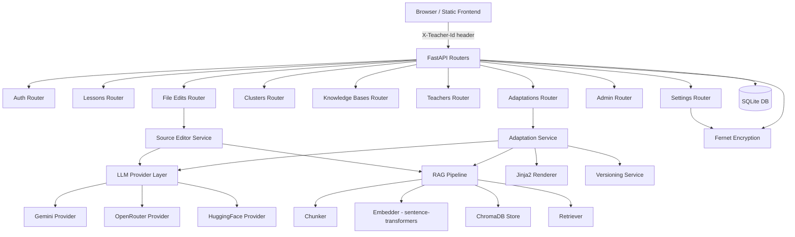

<!-- generated-by: gsd-doc-writer -->

# Architecture

ADAPT is an AI-driven personalized lesson planning tool for K-12 computer science educators. It takes a base lesson, a learner cluster profile, and optional knowledge bases (KBs), uses retrieval-augmented generation (RAG) to surface pedagogically relevant context, and calls an LLM to produce an adapted lesson plan as structured JSON. The plan is rendered into HTML via Jinja2, stored as an immutable version, and presented to the teacher through a static HTML/CSS/JS frontend. Teachers can refine plans iteratively, roll back to previous versions, and export results as HTML. The system also provides AI-powered source file editing for `.docx`, `.pptx`, and `.pdf` lesson materials.

## Component Diagram



## Data Flow

### Generate an Adapted Lesson

1. **Request** — `POST /api/adapt` with `lesson_id`, `cluster_id`, `kb_ids`, and `include_student_context`.
2. **Provider resolution** — `adaptation._resolve_provider()` checks for an active `LLMProviderConfig` for the teacher; falls back to `ADAPT_GEMINI_API_KEY` env var.
3. **Context assembly** — `_build_context_blocks()` composes a user prompt containing: base lesson metadata, cluster description, student profiles (if requested), and RAG-retrieved KB chunks.
4. **RAG retrieval** — `retriever.retrieve_for_lesson()` embeds the query with `sentence-transformers`, queries ChromaDB per KB (top-k cosine similarity), and returns `RetrievedChunk` objects.
5. **LLM generation** — The resolved provider calls its API with the system prompt (`prompts/system.txt`) and the assembled user prompt. The response is coerced from JSON (with fallback handling for fenced/malformed output).
6. **Rendering** — `renderer.render_lesson_plan()` fills `templates/lesson_plan.html.j2` with the plan JSON, lesson metadata, cluster info, and KB references to produce styled HTML.
7. **Versioning** — `versioning.create_version()` creates a new `LessonPlanVersion` row (with `is_head=1`), demoting any prior head version. The `AdaptedLesson` row is updated with the latest plan JSON fields.
8. **Audit logging** — `RAGContextLog` records the chunks used, token count, and which context layers were active.
9. **Response** — Returns `AdaptationOut` with the head version summary and full version history.

### Refine an Existing Plan

1. `POST /api/adaptations/{adapted_id}/refine` with a free-text `instruction`.
2. Loads the current head version's `plan_json` and includes it in the prompt with the teacher's refinement instruction.
3. Creates a new version linked to the previous one via `parent_version_id`.
4. All other steps mirror the Generate flow.

### Rollback

1. `POST /api/adaptations/{adapted_id}/rollback` with a `version_id`.
2. `versioning.rollback_to()` flips `is_head` flags — the target version becomes head; all others are demoted. No rows are deleted; all versions remain accessible.

### Source File Editing

1. `POST /api/lessons/{lesson_id}/edit-source-file` with a `source_path`, `instruction`, optional `cluster_id`, and `kb_ids`.
2. `source_editor` extracts text blocks from `.docx` (python-docx), `.pptx` (python-pptx), or `.pdf` (pdfplumber).
3. Text blocks are batched and sent to the LLM with RAG context for rewriting.
4. Rewritten text is reinserted into the original document format, preserving formatting where possible.
5. Output is saved to `uploads/lesson_edits/` and a download URL is returned.

## Key Abstractions

| Abstraction | File | Description |
|---|---|---|
| `LLMProvider` (Protocol) | `backend/llm/base.py` | Defines the `generate()` and `ping()` interface all LLM providers must implement. Returns `LLMResult` with text, model, provider, and token count. |
| `LLMResult` | `backend/llm/base.py` | Dataclass holding the LLM response: `text`, `model`, `provider`, `token_count`, `raw`. |
| `RetrievedChunk` | `backend/rag/retriever.py` | Dataclass for a RAG chunk: `kb_id`, `kb_name`, `section_title`, `text`, `distance`. |
| `Settings` | `backend/config.py` | Application configuration: DB path, ChromaDB path, embedding model, default LLM models, secret key for Fernet encryption. |
| `Base` | `backend/db.py` | SQLAlchemy declarative base; all 15 models inherit from this. |
| `session_scope()` | `backend/db.py` | Context manager providing a transactional DB session with auto-commit/rollback. |
| `current_teacher` | `backend/deps.py` | FastAPI dependency extracting the `X-Teacher-Id` header and loading the `Teacher` ORM object. |
| `require_admin` | `backend/deps.py` | FastAPI dependency that extends `current_teacher` and enforces `role == "admin"`. |
| `Chunk` | `backend/rag/chunker.py` | Dataclass for a text chunk: `section_title`, `text`, `order`. |
| `Versioning` | `backend/services/versioning.py` | Manages immutable `LessonPlanVersion` rows: `create_version()`, `head_version()`, `rollback_to()`, `parse_plan_json()`. |

## Directory Structure

```
ADAPT/
├── backend/                        # FastAPI application
│   ├── main.py                     # App factory, CORS, router registration, static mount
│   ├── config.py                   # Settings class (paths, env vars, default models)
│   ├── db.py                       # SQLAlchemy engine, SessionLocal, session_scope
│   ├── models.py                   # 15 SQLAlchemy ORM models
│   ├── schemas.py                  # Pydantic request/response schemas
│   ├── security.py                 # Fernet encrypt/decrypt/redact for API keys
│   ├── deps.py                     # FastAPI dependencies: current_teacher, require_admin
│   ├── routers/
│   │   ├── auth.py                 # Fake-auth endpoints (login picker, /me)
│   │   ├── lessons.py              # Lesson CRUD + source file editing
│   │   ├── adaptations.py          # Generate, refine, rollback, feedback, export
│   │   ├── clusters.py             # Cluster listing + KB association
│   │   ├── knowledge_bases.py      # KB listing
│   │   ├── teachers.py             # Dashboard, classes, student updates
│   │   ├── admin.py                # Institution overview (admin-only)
│   │   ├── settings.py             # LLM provider config per teacher
│   │   └── file_edits.py           # Download edited source files
│   ├── services/
│   │   ├── adaptation.py           # Orchestrate generate/refine: context, LLM call, render, version
│   │   ├── versioning.py           # Immutable version management for lesson plans
│   │   ├── renderer.py             # Jinja2 HTML rendering from plan JSON
│   │   └── source_editor.py        # AI-edit .docx/.pptx/.pdf source files
│   ├── llm/
│   │   ├── base.py                 # LLMProvider protocol + LLMResult dataclass
│   │   ├── gemini.py               # Google Gemini provider
│   │   ├── openrouter.py           # OpenRouter provider (OpenAI-compatible API)
│   │   └── huggingface.py          # HuggingFace Inference API provider
│   ├── rag/
│   │   ├── chunker.py              # Text extraction + section chunking
│   │   ├── embedder.py             # Sentence-transformers embedding wrapper
│   │   ├── store.py                # ChromaDB persistent client, upsert/query
│   │   └── retriever.py            # Retrieve KB chunks for a lesson query
│   ├── prompts/
│   │   └── system.txt              # System prompt for lesson generation LLM
│   └── templates/
│       └── lesson_plan.html.j2     # Jinja2 template for rendered lesson HTML
├── adapt-frontend-prototype-echristian-aduong/  # Static HTML/CSS/JS frontend
│   ├── login.html                  # Teacher login/picker
│   ├── dashboard.html              # Main dashboard
│   ├── personalize.html            # Lesson customization form
│   ├── results.html                 # Adapted lesson results
│   ├── print.html                  # Print view
│   ├── my-classes.html             # Class & student management
│   ├── lesson-library.html         # Lesson browser
│   ├── kb-browser.html             # Knowledge base browser
│   ├── settings.html               # LLM config per teacher
│   ├── admin-dashboard.html        # Admin overview
│   ├── admin-teachers.html         # Admin teacher management
│   ├── admin-classes.html          # Admin class management
│   ├── api.js                      # Shared API client
│   ├── auth.js                     # Auth utilities (localStorage)
│   └── style.css                   # Global styles
├── scripts/
│   ├── migrate.py                  # DDL from SQL for DB setup
│   ├── ingest_kbs.py               # Ingest KB files into ChromaDB
│   └── seed_versions.py            # Seed initial lesson plan versions
├── tests/
│   ├── test_api.py                 # Integration tests
│   ├── conftest.py                 # Test fixtures
│   └── manual-walkthrough.md       # Manual testing guide
├── Knowledge Bases/                # Source KB documents (PDF, TXT, etc.)
├── Sample Lessons/                 # Sample .docx/.pptx/.pdf lesson templates
├── .env.example                    # Environment variable template
├── keys.env.example                # Fernet key template
├── requirements.txt                # Python dependencies
└── start_server.py                 # Entrypoint script (uvicorn)
```

## Authentication & Authorization

ADAPT uses an MVP **fake-auth** model. The frontend sends an `X-Teacher-Id` header (sourced from `localStorage` after the login picker). Two roles exist:

- **Teacher** — Can access their own data: classes, students, adaptations, and LLM settings.
- **Admin** — Can access any teacher's data via the `/api/institutions/` endpoints.

API keys for LLM providers are encrypted at rest with **Fernet** symmetric encryption. The key is auto-generated on first run and persisted to `.secret_key` (or overridden via `ADAPT_SECRET_KEY` in `.env`).

## Database

SQLite is the sole database, configured via `SQLAlchemy` with `check_same_thread=False` for FastAPI's async-compatible sync sessions. The schema comprises 14 models covering the full domain:

- **Organizational**: `Institution`, `Teacher` (with `role` field for authorization)
- **Curricular**: `Class`, `StudentCluster`, `Student`, `Enrollment`, `Lesson`, `KnowledgeBase`, `ClusterKB`
- **Adaptation lifecycle**: `AdaptedLesson`, `LessonPlanVersion` (immutable versioning), `LessonKBUsed`, `AdaptationFeedback`, `RAGContextLog`
- **Configuration**: `LLMProviderConfig` (per-teacher encrypted API keys)

Versioning uses an `is_head` flag pattern — only one version per `AdaptedLesson` is marked as head at a time. Rollback simply flips flags; no data is ever deleted.

## LLM Provider Layer

The provider system uses the `LLMProvider` protocol defined in `backend/llm/base.py`. Three concrete implementations exist:

| Provider | Default Model | Transport |
|---|---|---|
| Gemini | `gemini-2.5-flash` | `google.generativeai` SDK |
| OpenRouter | `meta-llama/llama-3.1-8b-instruct:free` | REST API (OpenAI-compatible) |
| HuggingFace | `meta-llama/Llama-3.1-8B-Instruct` | REST API (Inference API) |

Each teacher can configure their own provider and API key via `PUT /api/teachers/{id}/llm-config`. Only one provider can be active per teacher at a time. If no per-teacher config exists, the system falls back to `ADAPT_GEMINI_API_KEY` from the environment.

## RAG Pipeline

The RAG subsystem ingests knowledge base documents and retrieves relevant chunks at adaptation time:

1. **Ingestion** (`scripts/ingest_kbs.py`) — Reads files from `Knowledge Bases/`, chunks them by section, embeds with `all-MiniLM-L6-v2` (configurable via `ADAPT_EMBEDDING_MODEL`), and upserts into **ChromaDB** collections scoped per `kb_id`.
2. **Retrieval** (`backend/rag/retriever.py`) — At adaptation time, the lesson query text is embedded and used to query each requested KB's ChromaDB collection with cosine similarity, returning the top-k chunks.
3. **Context injection** — Retrieved chunks are injected into the LLM prompt under a `# Knowledge base context` heading with KB id and section attribution.

## Frontend

The frontend is a static HTML/CSS/JS prototype served directly by FastAPI at `/app/`. It communicates exclusively with the `/api/` endpoints using fetch calls defined in `api.js`. Authentication state is held in `localStorage` (teacher ID). There is no build step or framework — all pages are self-contained HTML files sharing `style.css`, `api.js`, and `auth.js`.